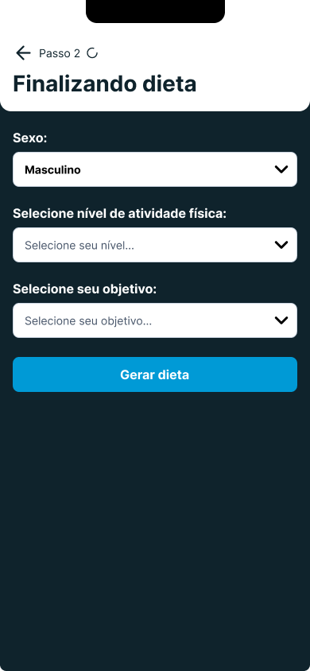
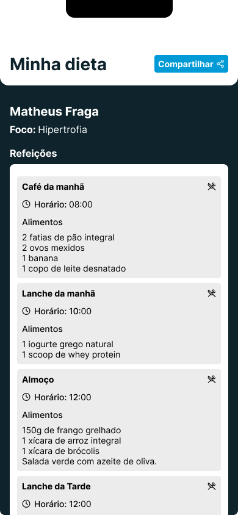

<h1 align="center"> Gerador de Dietas </h1>

 

  

  

  

  

## 🚀 Tecnologias

Esse projeto está sendo desenvolvido com as seguintes tecnologias:

 ## Backend

- Fastify/cors
-  cors
- Nodejs

## Mobile

- Typescript
- Reactnative
- Expo
- axios
- zod
- zustand
- jest
- Reactjs
- Javascript

## 💻 Projeto

gerador de dietas utilizando GeminiAI da Google. 